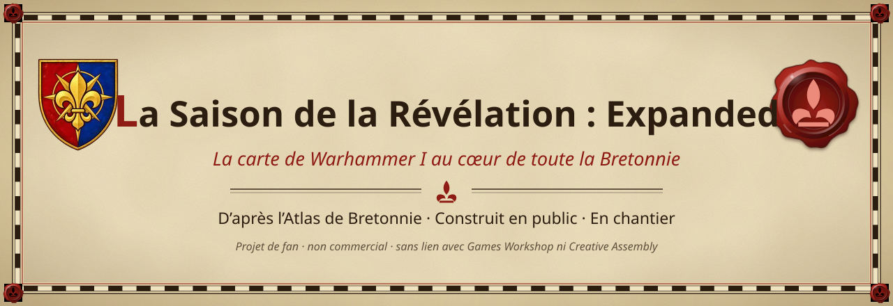

<a href="https://bretonia.dev"><b>Atlas de Bretonnie</b></a> ·
<a href="https://github.com/LeyZee/the-season-of-revelation"><b>La Saison originale</b></a> ·
<a href="docs/fr/JOURNAL.md"><b>Journal du chantier</b></a> ·
<a href="README.md"><b>Read in English</b></a>

**La Saison de la Révélation : Expanded** agrandit la carte de la mini-campagne de Warhammer I à **toute la Bretonnie**.
La carte de Warhammer I en est le cœur : son relief, ses objets, ses arbres et ses eaux sont gardés, tandis que ses
provinces sont redessinées d'après l'Atlas (villes nouvelles, trois raccords de côte). Autour, la terre de l'extension est dessinée
d'après l'[Atlas de Bretonnie](https://bretonia.dev) : les duchés, les montagnes, les côtes et, loin au sud, le Bois Rêveur. Le
chantier est **construit en public** : chaque étape est dans le [journal](docs/fr/JOURNAL.md).

##  D'un coup d'œil

| | |
|---|---|
| **Grille** | 560 × 825 hex. La carte de Warhammer I est placée en (+120, +250), un décalage pair comme CAIME l'exige. |
| **Au centre** | Le terrain de Warhammer I gardé (relief, objets, arbres, eaux) ; les provinces et trois raccords de côte suivent l'Atlas. Elle reste la zone jouable pour l'instant. |
| **Autour** | La terre de l'Atlas : relief modelé depuis ses altitudes, sols, forêts, rivières et côtes, raccordés en douceur au relief de Warhammer I. |
| **Le Bois Rêveur** | Le reflet d'Athel Loren en miroir, dans une mer d'éther, au sud de la forêt. |
| **Clés** | Carte `saison_expanded_map`, campagne `saison_expanded`, régions neuves `saison_…` ; jamais les clés de la bêta. |
| **État** | En chantier, pas encore jouable : grille, régions, villes et minicarte faites ; terrain de l'extension en cours (relief, rivières, Bois Rêveur). Voir le [PLAN](docs/fr/PLAN.md). Les collaborations sont ouvertes : issues, pull requests, et le Discord indiqué par [bretonia.dev](https://bretonia.dev). |

##  Ce qu'on trouve ici

- [`outils/`](outils/) : les outils d'Expanded. Ils font la grille, le relief, les raccords et les aperçus, et écrivent
  la déclaration de la carte (`spec_expanded.py` → `map_spec_expanded.json`).
- [`map_spec_expanded.json`](map_spec_expanded.json) : la déclaration de la carte.
- [`docs/fr/`](docs/fr/) : la page du chantier, le plan en phases, le journal horodaté.

**Absent, volontairement.** Tout ce qui dérive de Warhammer I (couches de carte, rasters de terrain, relief, aperçus,
packs) reste privé. Les outils lisent aussi les données géographiques de l'Atlas, qui appartiennent au projet privé du
site et ne sont pas fournies. La chaîne commune (terrain, données, pack) est dans le
[dépôt de la Saison originale](https://github.com/LeyZee/the-season-of-revelation).

##  Mentions

Warhammer et tous les noms associés appartiennent à **Games Workshop** ; Total War: WARHAMMER à **Creative Assembly**
et **SEGA**. Projet de fan non commercial, sans lien avec eux. Notre code : [licence MIT](LICENSE) ; voir la
[NOTICE](NOTICE.md).
