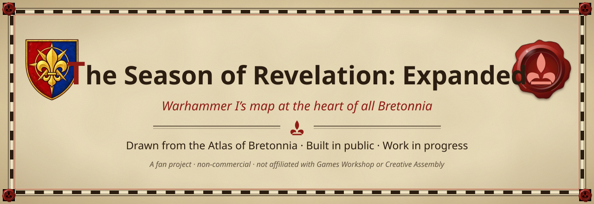

<a href="https://bretonia.dev"><b>Atlas of Bretonnia</b></a> ·
<a href="https://github.com/LeyZee/the-season-of-revelation"><b>The original Season</b></a> ·
<a href="docs/fr/JOURNAL.md"><b>Build journal</b></a> ·
<a href="README.fr.md"><b>Lire en français</b></a>

**The Season of Revelation: Expanded** grows Warhammer I's mini-campaign map into **all of Bretonnia**. Warhammer I's
map is the heart of it: its relief, props, trees and water are kept, while its provinces are redrawn after the Atlas
(new towns, three coastline seams). Around it, the land of the extension is drawn from the
[Atlas of Bretonnia](https://bretonia.dev): the dukedoms, the mountains, the coasts, and, far to the south, the Dreaming Wood.
It is **built in public**: every step is logged in the [journal](docs/fr/JOURNAL.md).

##  At a glance

| | |
|---|---|
| **Grid** | 560 × 825 hexes. Warhammer I's map is placed at (+120, +250), and the offset is even, as CAIME requires. |
| **Centre** | Warhammer I's terrain kept (relief, props, trees, water); provinces and three coastline seams follow the Atlas. It stays the playable area for now. |
| **Around** | New land from the Atlas: relief modelled from its heights, soils, forests, rivers and coasts, joined smoothly to Warhammer I's relief. |
| **The Dreaming Wood** | A mirrored reflection of Athel Loren in a sea of aether, south of the forest. |
| **Keys** | Map `saison_expanded_map`, campaign `saison_expanded`, new regions `saison_…`. The beta's keys are never reused. |
| **Status** | Work in progress: phase 2 (declared in the Assembly Kit). See [PLAN](docs/fr/PLAN.md). |

##  What is here

- [`outils/`](outils/): the Expanded tools. They build the grid, relief, joins and previews, and write the map
  declaration (`spec_expanded.py` → `map_spec_expanded.json`).
- [`map_spec_expanded.json`](map_spec_expanded.json): the map declaration (map, campaign, playable area, roads,
  regions).
- [`docs/fr/`](docs/fr/): the project page, the plan in phases, and the timestamped build journal (French).

**Not here, on purpose.** Everything derived from Warhammer I (map layers, terrain rasters, relief, previews, packs)
stays private. The tools also read the Atlas's geographic data, which belongs to the private site project and is not
provided. The shared build chain (terrain, data, pack) lives in the
[original Season repository](https://github.com/LeyZee/the-season-of-revelation) (`02-scripts`, map profiles in `carte_config.py`).

##  Legal

Warhammer and all related names belong to **Games Workshop**; Total War: WARHAMMER to **Creative Assembly** and
**SEGA**. Non-commercial fan project, not affiliated with or endorsed by them. Our code: [MIT licence](LICENSE); see
[NOTICE](NOTICE.md).
